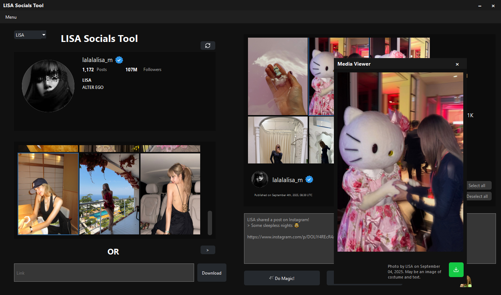

# LISA Socials Tool

<p align="center">
  
</p>

<p align="center">
  A desktop Instagram viewer and downloader for public content from <strong>LISA</strong> and related profiles.
</p>

---

## Overview

**LISA Socials Tool** is a fan-focused desktop application that lets you browse, preview, and download high-quality media from public Instagram accounts **without logging in**. Built with Qt and designed for usability, it fetches real-time content using Instagram’s public GraphQL API and provides rich metadata, captions, and shareable text snippets.

---

## Features

*   **Profile Browsing:** View profile info (bio, follower/post counts) for LISA, LLOUD, and LISA’s pets.
*   **Feed Loading:** Retrieve recent posts (images, videos, carousels) via Instagram’s internal GraphQL API.
*   **Post Viewing & Downloading:** Preview full posts and download high-resolution media (JPG/MP4).
*   **Story Support:** Fetch and display current Instagram Stories (requires session ID for +18/private content).
*   **Link Parsing:** Load content directly from Instagram post or story URLs.
*   **Text Generation:** Create Discord-ready quotes with auto-copy to clipboard.
*   **Bulk Operations:** Selectively download carousel items or entire feeds.
*   **Multi-language Support:** Available in English, German, French, Spanish, Dutch, Danish, Italian, Portuguese, Chinese, Japanese, Korean, and Thai.

## Preview



---

## Usage

1.  Launch **LISA Socials Tool**.
2.  Select a profile (LISA / LLOUD / LFAMILY) to load their feed.
3.  Click a post thumbnail to preview and download media.
4.  Paste an Instagram link into the input field to load specific content.
5.  Use the "Story" button to fetch current stories (session ID is required).
6.  Customize behavior in **Settings**.

## Developed using

*   **C++:** Core application logic.
*   **Qt 6:** Graphical user interface, networking, multimedia playback.
*   **Instagram API:** Data fetching via `/web_profile_info/` and GraphQL endpoints.
*   **Qt Resource System:** Embedded assets (icons, emojis).
*   **Inno Setup:** Windows installer packaging.
*   **Lucide:** Icons used throughout the application

## Technical Details

- **No login required:** uses public Instagram API endpoints
- Fetches data via:
  - `web_profile_info` (user metadata)
  - `X-IG-App-ID` + GraphQL queries (feed, stories, posts)
- **Image caching** to reduce redundant network requests

> 🔐 **Note**: Some content (e.g., +18 posts and all stories) requires a valid **Instagram session ID**, which can be added in Settings.

---

## Installation

1. Download the latest `.exe` installer from [Releases](https://github.com/rhewrani/LISA-Socials-Tool/releases)
2. Run the installer (Windows only)
3. Launch **LISA Socials Tool** from your Start Menu or desktop

> 💻 **Platform**: Windows 10/11 (64-bit)  
> 🌐 **Internet connection required**


### Building From Source

#### Prerequisites

*   C++ compiler (e.g., MSVC 2019/2022 for Windows)
*   Qt 6.x
*   CMake (version 3.16 or higher)

#### Steps

1.  Clone the repository:
    ```bash
    git clone https://github.com/rhewrani/LISA-Socials-Tool.git
    cd LISA-Socials-Tool
    ```
2.  Create a build directory:
    ```bash
    mkdir build
    cd build
    ```
3.  Configure the project using CMake.  
    **Note:** If CMake cannot find Qt automatically, you may need to specify its location via `-DQT_DIR`.

    **Example (Windows, Qt 6.x installed in `C:\Qt\6.9.1\msvc2022_64`):**
    ```bash
    cmake .. -DQT_DIR="C:/Qt/6.9.1/msvc2022_64/lib/cmake/Qt6"
    ```
    Replace the path with your actual Qt installation directory. Ensure the path points to the folder containing `Qt6Config.cmake`.

4.  Build the project in Release mode:
    ```bash
    cmake --build . --config Release
    ```
5.  Deploy dependencies using `windeployqt` (Windows only):
    ```bash
    windeployqt --release Release\LISA-Socials-Tool.exe
    ```
6.  Manually copy the `settings.json file` from the `src/templates` directory in the source code to the directory where the compiled `LISA-Socials-Tool.exe` executable is located (typically `build/` or `build/Release/`). This file contains the default settings needed by the application.

> **Note:** The application is currently **Windows-only** for now due to installer and deployment constraints. macOS/Linux support would require significant porting effort.

---

## License

This project is licensed under the GNU General Public License v3.0 (GPL-3.0).

This application uses Qt, a cross-platform framework licensed under the GNU General Public License (GPL) version 3.
Qt is Copyright (C) 2025 The Qt Company Ltd. and other contributors.
You are free to use, modify, and redistribute Qt under the terms of the GPLv3.
The source code for Qt is available at: https://code.qt.io
As this application itself is licensed under the GPLv3, the complete source code for this application is also available under the terms of the GPLv3.
For details, see the full license: https://www.gnu.org/licenses/gpl-3.0.html

## Made with ❤️ by rhewrani for the LISA Mod team
